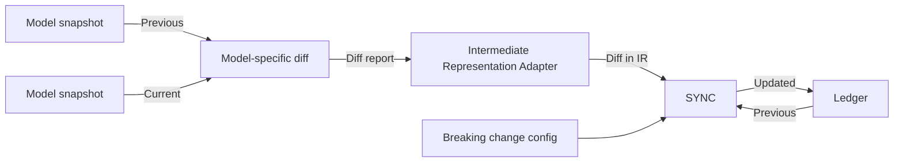
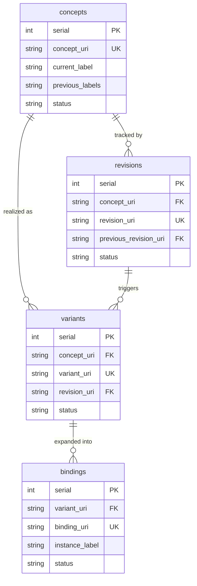

# Model Ledger

**Model Ledger** (`ModL`) is a tool for managing the identity of a domain data model over time — tracking what exists, what changed, and what that means for the systems that consume it.

## Overview

As a domain data model evolves, producers and consumers need stable answers to questions like:
- What concepts exist, and what do they mean?
- What changed between releases, and when?
- Has a change broken the data contract?
- What is the stable runtime address for a given model element?

`ModL` answers these by maintaining four normalized, append-only CSV tables — the **ledger** — co-released alongside the data model in a version-controlled repository. Records in the ledger are never deleted, only superseded. The git history provides point-in-time reproducibility.

## How It Works

`ModL` is language-agnostic. It does not parse model files directly. A language-specific adapter produces a **diff report** in `modl`'s intermediate representation (IR), which is fed into `modl` along with the previous ledger state and a breaking change configuration.



The diff report describes changes at the level of objects and their fields:

| Change | Example |
|---|---|
| Object added | New `Vehicle.Window` branch |
| Object removed | `Vehicle.OldFeature` deleted |
| Object modified | `Vehicle.Door` instances list changed |
| Field added | `Vehicle.Door.IsLocked` added |
| Field removed | `Vehicle.Door.IsOpen` removed |
| Field modified | `Vehicle.Speed` datatype changed from `Int` to `Float` |

## Building Blocks

`ModL` tracks model identity across four dimensions. The following example is used throughout:

```yaml
Vehicle:
    type: branch

Vehicle.Speed:
    type: sensor
    datatype: Float

Vehicle.Door:
    type: branch
    instances: [Left, Right]

Vehicle.Door.IsOpen:
    type: sensor
    datatype: Boolean
```

### Concepts

A concept is the **agreed meaning** of a model element — what it *is*, independent of any implementation detail. Think of it as a dictionary entry.

| Kind | Label | Meaning |
|---|---|---|
| Entity | `Vehicle` | A motorized thing used for transporting people or goods |
| Entity | `Door` | A hinged or sliding barrier at the entrance to a vehicle |
| Field | `Vehicle.Speed` | The rate at which a vehicle moves |
| Field | `Door.IsOpen` | Whether a door is open or closed |

Concepts are identified once and never reassigned. If a concept is renamed, the old label is recorded as a previous label — the concept identity does not change.

### Revisions

A revision is assigned to **every detected change**, regardless of whether it is breaking. It is the raw audit log of what happened.

Examples of changes that trigger a new revision:
- A typo fix (`Vehicl` → `Vehicle`)
- A unit change (`km/h` → `mph`)
- A description update
- A field being added or removed
- An instance list changing

### Variants

A variant captures the **data contract** for a field — a specific snapshot of its essential metadata. What counts as "essential" is **user-defined** via a configuration file. Any change to an essential attribute triggers a new variant.

For example, if `datatype` is declared essential for `Vehicle.Speed`:

| variant_uri | Snapshot | Status |
|---|---|---|
| `http://namespace.example/variants/10` | `Vehicle.Speed { datatype: Int }` | SUPERSEDED |
| `http://namespace.example/variants/14` | `Vehicle.Speed { datatype: Float }` | ACTIVE |

These are two variants of the same concept — the meaning of "speed" has not changed, but the data contract has.

Variants apply to **both entities and fields**. An entity's essential metadata (e.g., its `type` or instance list) defines its contract just as a field's `datatype` defines its own. Each element's variant is governed independently by its own essential attribute configuration.

### Bindings

Bindings assign a stable identity to every runtime-addressable path a property can appear on.

For `Vehicle.Door` with `instances: [Left, Right]`, the field `Door.IsOpen` expands into:

| serial | binding_uri | Runtime path |
|---|---|---|
| 24 | `http://namespace.example/bindings/o` | `Vehicle.Door.Left.IsOpen` |
| 25 | `http://namespace.example/bindings/p` | `Vehicle.Door.Right.IsOpen` |

A system can then write a compact payload like `24: true` to mean *"the left door is open"*, without encoding the full path.

For a property whose parent entity has no instances (e.g., `Battery.StateOfCharge`), one binding is still minted with no instance label:

| serial | binding_uri | Runtime path |
|---|---|---|
| 42 | `http://namespace.example/bindings/16` | `Battery.StateOfCharge` |

> **Note:** Bindings are assigned to **fields only**. Entities have concepts, revisions, and variants, but they are not directly addressable at runtime and therefore have no bindings. Vocabulary entities (enums, units) additionally carry `binding: false` in their entity aspects, which suppresses binding minting for all their child properties.

#### Instance expansion behavior

When a new instance is added (e.g., `Center`), the behavior depends on the breaking change configuration:

| Config | Entity revision | Entity variant | Field revision | Field variant | New binding |
|---|---|---|---|---|---|
| **Breaking** | yes | yes | yes | yes (new) | yes, anchored to new variant |
| **Non-breaking** | yes | no | yes | no (unchanged) | yes, appended to existing variant |

In the non-breaking case, existing binding IDs remain stable and consumers are unaffected. Binding sets under a variant are **append-only**.

### What each event writes to the ledger

The table below shows which rows `modl sync` creates or updates for each type of change event, given the breaking-change classification configured by the user.

| Event | concepts | revisions | variants | bindings |
|---|---|---|---|---|
| Entity `ADDED` | new row | new row | new row (initial variant) | — |
| Entity `MODIFIED`, non-breaking | update `current_label` if renamed | new row | — (unchanged) | — |
| Entity `MODIFIED`, breaking | update `current_label` if renamed | new row | new row | new rows for all child properties |
| Entity `REMOVED` | status → SUPERSEDED | new row | status → SUPERSEDED | status → SUPERSEDED |
| Property `ADDED` | new row | new row | new row (initial variant) | new binding per instance; one singleton if no instances |
| Property `MODIFIED`, non-breaking | update `current_label` if renamed | new row | — (unchanged) | — |
| Property `MODIFIED`, breaking | update `current_label` if renamed | new row | new row | new rows (anchored to new variant) |
| Property `REMOVED` | status → SUPERSEDED | new row | status → SUPERSEDED | status → SUPERSEDED |

Key observations:
- Every event produces a revision — the revision log is unconditional and unfiltered.
- A variant is only created or superseded when a change is classified as breaking by the config. Non-breaking changes leave the active variant untouched, so any system holding a variant URI or binding URI is unaffected.
- A rename never changes the concept URI. It updates `current_label` and appends the old label to `previous_labels` in the concept row.

## The Ledger Tables

### Serial and URI minting

Each record minted is assigned a `serial` number — a monotonically increasing non-negative integer, never reused. The serial is permanently baked into the record's Uniform Resource Identifier (URI):

```
uri = namespace + table_name + "/" + base36(serial)
```

Base36 uses alphabet `0-9a-z` (lowercase ASCII). Values 0–9 encode as single decimal digits, values 10–35 as single letters (`a`–`z`); larger values use multiple characters (e.g., serial 40 → `14`, serial 103 → `2v`).

**Authorship rule:** the ledger contains only records minted by the project owner. Every row has a serial number and a URI under the project namespace. Foreign Key (FK) columns (`concept_uri`, `variant_uri`, etc.) may reference URIs from other namespaces — those are foreign references, not rows authored here.

**Cross-namespace imports (Work in progress):** when a model references elements from an external project, the importing project ships its own ledger alongside a pruned copy of the external ledger containing only the referenced rows, annotated with provenance (source namespace, release URL, content hash).

### `concepts.csv`

| serial | concept_uri | current_label | previous_labels | status |
|---|---|---|---|---|
| 0 | `http://namespace.example/concepts/0` | Vehicle | — | ACTIVE |
| 1 | `http://namespace.example/concepts/1` | Vehicle.Speed | Vehicle.Velocity | ACTIVE |
| 2 | `http://namespace.example/concepts/2` | Vehicle.Door | — | ACTIVE |
| 8 | `http://namespace.example/concepts/8` | Vehicle.Door.IsOpen | — | ACTIVE |

### `revisions.csv`

| serial | concept_uri | revision_uri | previous_revision_uri | status |
|---|---|---|---|---|
| 56 | `http://namespace.example/concepts/0` | `http://namespace.example/revisions/1k` | — | ACTIVE |
| 57 | `http://namespace.example/concepts/8` | `http://namespace.example/revisions/1l` | — | SUPERSEDED |
| 103 | `http://namespace.example/concepts/8` | `http://namespace.example/revisions/2v` | `http://namespace.example/revisions/1l` | ACTIVE |

### `variants.csv`

| serial | concept_uri | variant_uri | revision_uri | status |
|---|---|---|---|---|
| 40 | `http://namespace.example/concepts/8` | `http://namespace.example/variants/14` | `http://namespace.example/revisions/2v` | ACTIVE |

### `bindings.csv`

| serial | variant_uri | binding_uri | instance_label | status |
|---|---|---|---|---|
| 24 | `http://namespace.example/variants/14` | `http://namespace.example/bindings/o` | Left | ACTIVE |
| 25 | `http://namespace.example/variants/14` | `http://namespace.example/bindings/p` | Right | ACTIVE |
| 42 | `http://namespace.example/variants/1e` | `http://namespace.example/bindings/16` | *(null)* | ACTIVE |

The third row is a **singleton binding** — `Battery.StateOfCharge` whose parent has no instances. `instance_label` is null; the binding still provides a stable, versioned identity for the runtime path.

### Table relationships




## Usage

The following commands assume an active environment, see [CONTRIBUTING](./CONTRIBUTING.md) for instructions on how to set it up.

### `modl sync`

Synchronises the ledger with a diff report. If no ledger exists yet, it is created. If no diff report is provided, an empty ledger is initialised.

```shell
modl sync --ledger-dir PATH --config PATH [--diff-report PATH] [--dry-run] [--strict]
```

| Option | Description |
|---|---|
| `-d`, `--diff-report` | Path to the diff report JSON file (optional). Omit to initialise an empty ledger. |
| `-o`, `--ledger-dir` | Directory where the four ledger CSV files are read from and written to. |
| `-c`, `--config` | Path to the breaking change config YAML file. |
| `-n`, `--dry-run` | Preview what would change without writing anything to disk. Exits with code `1` if changes would be made. |
| `-s`, `--strict` | Treat aspect keys in the diff report that are not declared in the config as errors instead of warnings. |

#### Config file format

```yaml
namespace:
  namespace: "http://namespace.example/"  # must end with '/' or '#'; full URIs are stored in the ledger
  prefix: "ns"                            # optional display alias; used by inspection commands to shorten output

entity:
  instances: true   # breaking — triggers a new variant
  type: true        # breaking — triggers a new variant
  name: false       # renames are non-breaking; suppresses --strict warnings

property:
  output_type: true  # breaking — triggers a new variant
  unit: true         # breaking — triggers a new variant
  accuracy: true     # user-defined domain-specific attribute
  description: false # known, non-breaking; suppresses --strict warnings
```

Only `namespace.namespace` is required. The `entity` and `property` sections default to empty — all changes are treated as non-breaking if omitted.

Each key maps to a boolean with three distinct states:

| Value | Meaning |
|---|---|
| `true` | Aspect is **breaking** — a change triggers a new variant. |
| `false` | Aspect is **known but non-breaking** — changes are silently accepted; no warning even with `--strict`. |
| *(absent)* | Aspect is **unknown** — treated as non-breaking but produces a warning (error with `--strict`). |

The reserved key `name` governs rename events (`renamed_from` set on a diff event). It never appears in `aspects` — it is checked separately via `renamed_from`.

#### Diff report format

The diff report is a JSON file produced by a language-specific adapter (e.g. for vspec, GraphQL SDL). It describes what changed between two model snapshots using `modl`'s intermediate representation.

Each change event covers either an **entity** (container, object type, branch) or a **property** (field, attribute, signal). Key fields:

| Field | Values |
|---|---|
| `kind` | `ENTITY` or `PROPERTY` |
| `change_type` | `ADDED`, `REMOVED`, or `MODIFIED` |
| `aspects` | On `ADDED`: full initial-state snapshot. On `MODIFIED`: delta of changed keys only. Absent on `REMOVED`. |
| `renamed_from` | Previous label when the element was renamed (`MODIFIED` only). |
| `parent_label` | Required for `PROPERTY` — the label of the owning entity. |
| `content` | `ENTITY` `MODIFIED` only — list of `{label, change_type}` for children that changed. |

See [diff_report_template.md](diff_report_template.md) for the full field reference, rename semantics, examples, and an adapter implementation checklist.

## Adoption Guide

### 1. Define your model and take a snapshot

Represent your domain model in your chosen modeling language (vspec, GraphQL SDL, JSON Schema, etc.). A **snapshot** is the complete state of the model at a point in time — a version-controlled file, a release artifact, or a git tag. The diff is always computed between two such snapshots: the previous release and the current one.

### 2. Produce a diff between two snapshots

Compare two snapshots of your model to enumerate what was added, removed, or modified. The mechanism depends on your modeling language:

- **Text-based formats** (YAML, JSON): diff the files and post-process the output.
- **Structured formats with tooling** (vspec, Protobuf): use the language's own comparison tool if one exists, or write a script that loads both snapshots and walks the element tree.
- **Schema registries**: use the registry's diff API if available.

For the first release there is no previous snapshot — treat every element as `ADDED`.

### 3. Write an adapter that translates the diff into the ModL IR format

The adapter is a script or tool — typically a short Python or shell program — that takes your language-specific diff output and writes a `diff.json` file in the [ModL intermediate representation](diff_report_template.md). At its simplest:

```
# pseudocode
previous = load("model-v1.yaml")
current  = load("model-v2.yaml")
changes  = compare(previous, current)   # language-specific logic
write_json("diff.json", to_modl_ir(changes))
```

The adapter is a one-time investment per modeling language. See [diff_report_template.md](diff_report_template.md) for the full field reference, rename semantics, and an adapter implementation checklist.

### 4. Author a breaking-change config

Create a YAML config that declares your project's namespace and which aspect keys constitute a breaking change. Start minimal — only `namespace` is required:

```yaml
namespace:
  namespace: "https://myproject.org/model/"
  prefix: "mp"
```

Add `entity` and `property` keys as you identify which attributes define your data contract. Use `true` for breaking aspects, `false` to explicitly mark a key as known-but-non-breaking (silences `--strict` warnings).

### 5. Validate with a dry run

Before touching the ledger, pass the diff report through `modl sync` with `--dry-run` and `--strict`:

```shell
modl sync --ledger-dir ledger/ --config modl.yaml --diff-report diff.json --dry-run --strict
```

Review any warnings about undeclared aspect keys. For each unknown key, decide: is it breaking (`true`) or intentionally non-breaking (`false`)? Update the config and re-run until the dry run is clean.

### 6. Initialise the ledger

On the first run, the ledger does not exist yet. `modl sync` creates it. For a first release where you want to capture the initial model state, pass the diff report that treats every element as `ADDED`. To start with an empty ledger and add history in subsequent syncs, omit `--diff-report`.

```shell
modl sync --ledger-dir ledger/ --config modl.yaml --diff-report initial_diff.json
```

Persist (e.g., release) the four generated CSV files (`concepts.csv`, `revisions.csv`, `variants.csv`, `bindings.csv`) alongside your model.

### 7. Sync on every subsequent release

For each new model release, produce a diff between the previous and current snapshots, run the adapter, and sync:

```shell
modl sync --ledger-dir ledger/ --config modl.yaml --diff-report diff.json
```

Persist (e.g., release) the updated ledger files with the latest composed model. The ledger is append-only — existing records are never modified, only new rows are added or existing ones marked `SUPERSEDED`.

`modl sync` is designed to be a CI/CD step that runs automatically on every release. A typical pipeline stage looks like:

```
1. validate model
2. run adapter → diff.json
3. modl sync --ledger-dir ledger/ --config modl.yaml --diff-report diff.json --strict
4. commit and tag updated ledger CSV files
```

### 8. Iterate on the config as the model evolves

When the adapter emits a new aspect key that is not yet in the config, `modl` warns. Decide whether it is breaking or non-breaking and add it to the config. Run the dry run again to confirm the warning is resolved before syncing.


## Contributing

See [here](CONTRIBUTING.md) if you would like to contribute.

## Design Decisions and Discarded Alternatives

This section documents the rationale behind key design decisions and the alternatives that were considered and rejected. It serves as a reference when the design is challenged.

### Why four tables?

One could argue that concepts and variants are sufficient: concepts capture identity, variants capture the data contract. This is true only if what constitutes a breaking change is known a priori and applies uniformly to all downstream consumers. In practice, different teams have different definitions of "breaking". The four-table split reflects this:

- **concepts** — stable identity; what a thing *is*, regardless of how it changes
- **revisions** — a complete, unfiltered audit log of every detected change; does not judge whether a change is breaking
- **variants** — derived from revisions using a user-configurable set of essential attributes; two rows share a variant only if nothing essential to *that project's* definition of "breaking" changed
- **bindings** — some modeling languages define entity instances (e.g., `Door: [Left, Right]`), which expand fields into multiple individually addressable runtime paths; bindings assign a stable identity to each such path

Merging revisions and variants would either force a single global breaking-change policy or lose the audit trail. Merging bindings into variants would require variants to know about instance expansion, coupling two independent concepts.

### Why URIs as identifiers?

The alternative is opaque integers or short labels. URIs were chosen because:

- They are globally unique without coordination — two independent projects can mint records and their identifiers will never collide
- They are self-describing: a URI encodes the namespace (who minted it), the table (what kind of record it is), and the serial (which record)
- They are dereferenceable in principle — a namespace owner can publish human-readable documentation at the URI
- They compose naturally across namespaces: FK columns in one project's ledger can reference URIs minted by another project without any registry or mapping table

Plain integers require a global registry to avoid collisions across projects. Short labels (CURIEs) require a prefix resolution context that must travel with every document that uses them.

### Why full URIs stored in the CSV tables, not CURIEs?

CURIEs such as `ns:0` are shorter but require the prefix-to-namespace map to be present and unambiguous at read time. A CSV file is a standalone artifact — it may be opened months later, sent to another team, or imported by a tool that has no knowledge of the original prefix declarations. Full URIs make each CSV self-contained: the namespace authority, the table name, and the serial are all recoverable from the value itself without external context.

The config file's `prefix` field is an optional display alias used by inspection commands to shorten output. It is never stored in the ledger.

### Why base36 for the URI suffix, not decimal?

The serial is a decimal integer internally. Decimal would be the simplest choice, but base36 was chosen for URI compactness. A model with tens of thousands of records would produce 5-digit decimal suffixes; the same range in base36 fits in 3 characters. Compact URIs matter in serialisation-heavy use cases (payloads, QR codes, logs).

Hexadecimal (base16) was rejected because it is less compact than base36 and gains nothing beyond familiarity.

### Why base36 and not base62 or base64?

Base62 (`0-9A-Za-z`) and base64 (`0-9A-Za-z+/=`) are more compact than base36 for the same integer range. They were rejected because:

- **Case ambiguity**: base62 uses both uppercase and lowercase letters. URIs are technically case-sensitive, but in practice URLs are routinely lowercased by proxies, logs, and developers. A URI like `.../revisions/1K` and `.../revisions/1k` would decode to different serials — a silent data corruption hazard.
- **No stdlib decode**: Python has no built-in base62 decoder. `int(s, 36)` is part of the language; base62 requires a third-party library or hand-rolled code.
- **URL safety**: base64 uses `+`, `/`, and `=`, which require percent-encoding in URIs. Base64url replaces them with `-` and `_`, but introduces yet another non-standard alphabet.

Base36 uses only `0-9a-z` — all characters that are unambiguous in URLs, universally lowercased, and directly supported by Python's `int(s, 36)`.

### Why a language-agnostic intermediate representation?

ModL does not parse model files directly. A language-specific adapter produces a diff report in a simple JSON format, which ModL then processes. This separation exists because:

- The identity ledger is valuable across modeling languages (vspec, GraphQL SDL, JSON Schema, etc.). The four-table structure and URI semantics are language-agnostic; only the diff production is language-specific.
- Migrations and imports between modeling languages should preserve identity: if a concept previously defined in vspec is migrated to another language, its URI should not change. A shared IR makes this possible.
- The adapter is a thin, replaceable component. ModL's validation, minting, and audit logic does not need to change when a new modeling language is supported.

### Why CSV and not SQLite or another format?

- **Git-friendly**: CSV produces line-level diffs in `git diff`. A change to a single record is visible as a single changed line. Binary formats (SQLite, Parquet) produce opaque binary diffs.
- **Human-readable**: CSV files can be opened directly in a spreadsheet or text editor. They are suitable as release artifacts that non-technical stakeholders can inspect.
- **No tooling dependency**: reading a CSV requires no database engine, no schema migration, no driver. Any language or environment with a standard library can parse it.
- **Easy manipulation**: pandas, polars, and the Python `csv` module all handle CSV natively.

SQLite may be offered as an optional release artifact in the future to support consumers who prefer to run SQL queries over the ledger.

### Why append-only? Why are records never deleted?

The ledger is designed for transparent governance, traceability, and provenance in data modeling projects. Deleting or modifying a record would:

- Break any downstream system that holds a reference to the deleted URI
- Make it impossible to reconstruct the state of the model at a past point in time without relying solely on git history
- Undermine the audit trail needed to answer questions like "what did this field mean at the time this data was produced?"

Records that are no longer current are marked `SUPERSEDED` or `REMOVED`. The full history remains readable. The git history provides point-in-time reproducibility at the repository level; the ledger tables provide it at the record level without requiring a git checkout.

### Why `previous_labels` as a list column in `concepts.csv`?

An alternative is a separate rename-history table (e.g., `concept_label_history.csv`) with one row per rename event. That would be more normalised and queryable. The list column was chosen for simplicity: label history is rarely queried independently, and the added table would require its own schema validation, FK constraints, and serial management. A flat list in the concepts table is sufficient for the primary use case — knowing what a concept used to be called — without adding a fifth table to the ledger.

If richer label history (timestamps, attribution) becomes necessary, a dedicated table is the natural upgrade path.

### Why co-release the ledger in the same repository as the model?

Each model release produces a snapshot. A diff between two snapshots produces a diff report. That diff report is passed directly to ModL to update the ledger. Keeping the ledger in the same repository means:

- Every model release tag also tags the corresponding ledger state; consumers can check out any release and find a consistent pair
- The ledger is a self-contained artifact: it does not require references to an external repository to be meaningful
- CI/CD pipelines operate on a single repository checkout

A separate ledger repository would require coordinated releases across two repositories, introduce the risk of the ledger falling out of sync with the model, and require consumers to know about and access a second repository.
