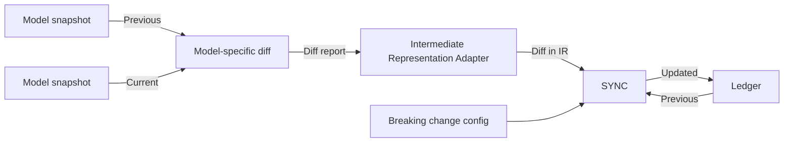
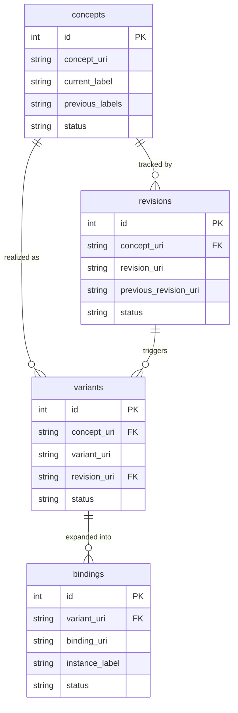

# Model Ledger

**Model Ledger** (`ModL`) is a tool for managing the identity of a domain data model over time — tracking what exists, what changed, and what that means for the systems that consume it.

## Overview

As a domain data model evolves, producers and consumers need stable answers to questions like:
- What concepts exist, and what do they mean?
- What changed between releases, and when?
- Has a change broken the data contract?
- What is the stable runtime address for a given model element?

`ModL` answers these by maintaining four normalized, append-only CSV tables — the **ledger** — co-released alongside the data model in a version-controlled repository. Records in the ledger are never deleted, only superseded. The git history provides point-in-time reproducibility.

## How It Works

`ModL` is language-agnostic. It does not parse model files directly. A language-specific adapter produces a **diff report** in `modl`'s intermediate representation (IR), which is fed into `modl` along with the previous ledger state and a breaking change configuration.



The diff report describes changes at the level of objects and their fields:

| Change | Example |
|---|---|
| Object added | New `Vehicle.Window` branch |
| Object removed | `Vehicle.OldFeature` deleted |
| Object modified | `Vehicle.Door` instances list changed |
| Field added | `Vehicle.Door.IsLocked` added |
| Field removed | `Vehicle.Door.IsOpen` removed |
| Field modified | `Vehicle.Speed` datatype changed from `Int` to `Float` |

## Building Blocks

`ModL` tracks model identity across four dimensions. The following example is used throughout:

```yaml
Vehicle:
    type: branch

Vehicle.Speed:
    type: sensor
    datatype: Float

Vehicle.Door:
    type: branch
    instances: [Left, Right]

Vehicle.Door.IsOpen:
    type: sensor
    datatype: Boolean
```

### Concepts

A concept is the **agreed meaning** of a model element — what it *is*, independent of any implementation detail. Think of it as a dictionary entry.

| Kind | Label | Meaning |
|---|---|---|
| Entity | `Vehicle` | A motorized thing used for transporting people or goods |
| Entity | `Door` | A hinged or sliding barrier at the entrance to a vehicle |
| Field | `Vehicle.Speed` | The rate at which a vehicle moves |
| Field | `Door.IsOpen` | Whether a door is open or closed |

Concepts are identified once and never reassigned. If a concept is renamed, the old label is recorded as a previous label — the concept identity does not change.

### Revisions

A revision is assigned to **every detected change**, regardless of whether it is breaking. It is the raw audit log of what happened.

Examples of changes that trigger a new revision:
- A typo fix (`Vehicl` → `Vehicle`)
- A unit change (`km/h` → `mph`)
- A description update
- A field being added or removed
- An instance list changing

### Variants

A variant captures the **data contract** for a field — a specific snapshot of its essential metadata. What counts as "essential" is **user-defined** via a configuration file. Any change to an essential attribute triggers a new variant.

For example, if `datatype` is declared essential for `Vehicle.Speed`:

| variant_uri | Snapshot | Status |
|---|---|---|
| `ns-v:10` | `Vehicle.Speed { datatype: Int }` | SUPERSEDED |
| `ns-v:40` | `Vehicle.Speed { datatype: Float }` | ACTIVE |

These are two variants of the same concept — the meaning of "speed" has not changed, but the data contract has.

Variants apply to **both entities and fields**. An entity's essential metadata (e.g., its `type` or instance list) defines its contract just as a field's `datatype` defines its own. Each element's variant is governed independently by its own essential attribute configuration.

### Bindings

Some modeling languages let you specify **instances** of an entity, which expands its fields into multiple addressable runtime paths. Bindings assign a stable identity to each of those paths.

For `Vehicle.Door` with `instances: [Left, Right]`, the field `Door.IsOpen` expands into:

| binding_uri | Runtime path |
|---|---|
| `ns-b:24` | `Vehicle.Door.Left.IsOpen` |
| `ns-b:25` | `Vehicle.Door.Right.IsOpen` |

A system can then write a compact payload like `24: true` to mean *"the left door is open"*, without encoding the full path.

> **Note:** Bindings are assigned to **fields only**. Entities have concepts, revisions, and variants, but they are not directly addressable at runtime and therefore have no bindings.

#### Instance expansion behavior

When a new instance is added (e.g., `Center`), the behavior depends on the breaking change configuration:

| Config | Entity revision | Entity variant | Field revision | Field variant | New binding |
|---|---|---|---|---|---|
| **Breaking** | yes | yes | yes | yes (new) | yes, anchored to new variant |
| **Non-breaking** | yes | no | yes | no (unchanged) | yes, appended to existing variant |

In the non-breaking case, existing binding IDs remain stable and consumers are unaffected. Binding sets under a variant are **append-only**.

## The Ledger Tables

### `concepts.csv`

| id | concept_uri | current_label | previous_labels | status |
|---|---|---|---|---|
| 0 | ns-c:0 | Vehicle | — | ACTIVE |
| 1 | ns-c:1 | Vehicle.Speed | Vehicle.Velocity | ACTIVE |
| 2 | ns-c:2 | Vehicle.Door | — | ACTIVE |
| 8 | ns-c:8 | Vehicle.Door.IsOpen | — | ACTIVE |

### `revisions.csv`

| id | concept_uri | revision_uri | previous_revision_uri | status |
|---|---|---|---|---|
| 56 | ns-c:0 | ns-r:56 | — | ACTIVE |
| 57 | ns-c:8 | ns-r:57 | — | SUPERSEDED |
| 103 | ns-c:8 | ns-r:103 | ns-r:57 | ACTIVE |

### `variants.csv`

| id | concept_uri | variant_uri | revision_uri | status |
|---|---|---|---|---|
| 40 | ns-c:8 | ns-v:40 | ns-r:103 | ACTIVE |

### `bindings.csv`

| id | variant_uri | binding_uri | instance_label | status |
|---|---|---|---|---|
| 24 | ns-v:40 | ns-b:24 | Left | ACTIVE |
| 25 | ns-v:40 | ns-b:25 | Right | ACTIVE |

### Table relationships




## Usage

The following commands assume an active enrironment, see [CONTRIBUTING](./CONTRIBUTING.md) for instructions on how to set it up.

### `modl sync`

Synchronises the ledger with a diff report. If no ledger exists yet, it is created. If no diff report is provided, an empty ledger is initialised.

```shell
modl sync [DIFF_REPORT] --ledger-dir PATH --config PATH [--dry-run]
```

| Argument / Option | Description |
|---|---|
| `DIFF_REPORT` | Path to the diff report JSON file (optional). Omit to initialise an empty ledger. |
| `--ledger-dir` | Directory where the four ledger CSV files are read from and written to. |
| `--config` | Path to the breaking change config YAML file. |
| `--dry-run` | Preview what would change without writing anything to disk. Exits with code `1` if changes would be made. |

#### Config file format

```yaml
namespace:
  namespace: "https://myproject.org/model"  # base URI for all ledger entries
  prefix: "mp"                               # optional short prefix; URIs render as mp-c:0 instead of the full namespace

entity:
  essential_attributes:
    - instances   # a change to the instance list is a breaking change
    - type

property:
  essential_attributes:
    - datatype    # standard attribute
    - unit        # standard attribute
    - accuracy    # user-defined domain-specific attribute
```

Only `namespace.namespace` is required. The `entity` and `property` sections default to empty — all changes are treated as non-breaking if omitted.

#### Diff report format

The diff report is a JSON file that describes what changed between two model snapshots. It uses the intermediate representation that `modl` understands:

```json
{
  "changes": [
    {
      "label": "Vehicle.Door",
      "kind": "ENTITY",
      "change_type": "MODIFIED",
      "changed_attributes": { "instances": ["Left", "Right", "Center"] }
    },
    {
      "label": "Vehicle.Speed",
      "parent_label": "Vehicle",
      "kind": "PROPERTY",
      "change_type": "MODIFIED",
      "changed_attributes": { "datatype": "Float" }
    }
  ]
}
```

| Field | Values |
|---|---|
| `kind` | `ENTITY` (branch/object type/class) or `PROPERTY` (field/attribute/signal) |
| `change_type` | `ADDED`, `REMOVED`, or `MODIFIED` |
| `changed_attributes` | Key-value map of what changed. Required for `MODIFIED`; empty `{}` for `ADDED`/`REMOVED`. |
| `parent_label` | Required for `PROPERTY` — the label of the owning entity. |

A language-specific adapter (e.g. for vspec, GraphQL SDL) is responsible for producing this JSON from a model diff.

## Contributing

See [here](CONTRIBUTING.md) if you would like to contribute.
