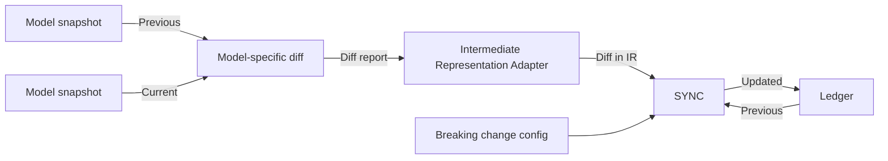
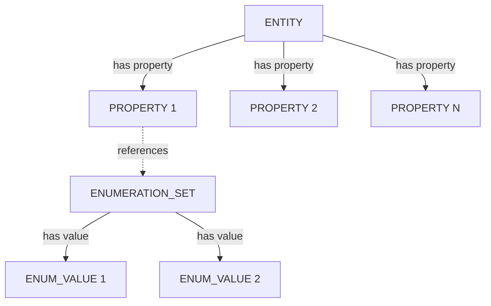
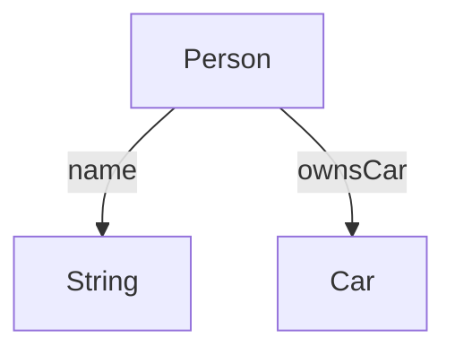
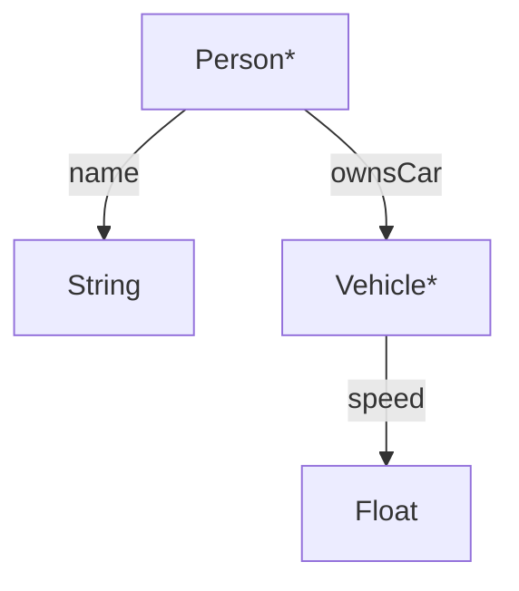
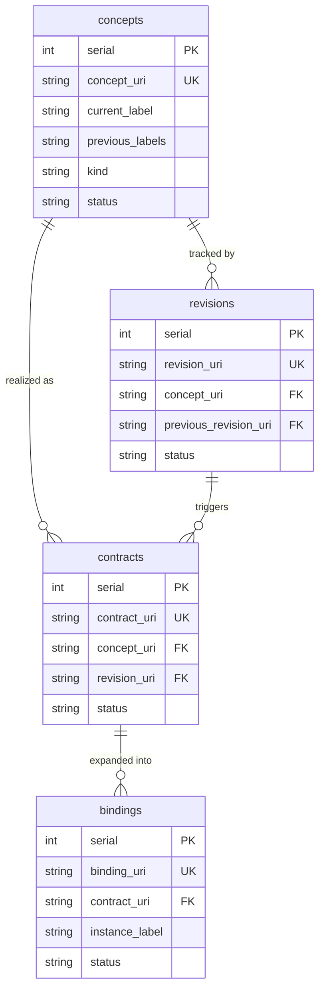

# Model Ledger


**Model Ledger** (`ModL`) is a tool for managing the identity of a domain data model over time — tracking what exists, what changed, and what that means for the systems that consume it.

## Overview

As a domain data model evolves, producers and consumers need stable answers to questions like:
- What concepts exist, and what do they mean?
- What changed between releases, and when?
- Has a change broken the data contract?
- What is the stable runtime address for a given model element?

`ModL` answers these by maintaining four normalized, append-only CSV tables — the **ledger** — co-released alongside the data model in a version-controlled repository. Records in the ledger are never deleted, only superseded. The git history provides point-in-time reproducibility.

## How It Works

`ModL` is language-agnostic. It does not parse model files directly. A language-specific adapter produces a **diff report** in `modl`'s intermediate representation (IR), which is fed into `modl` along with the previous ledger state and a breaking change configuration.


```mermaid
flowchart LR
    A[Model snapshot] --> |Previous| DIFF[Model-specific diff]
    B[Model snapshot] --> |Current| DIFF
    DIFF --> |Diff report| ADAPTER[Intermediate Representation Adapter]
    ADAPTER --> |Diff in IR| SYNC
    LEDGER[Ledger] --> |Previous| SYNC
    F[Breaking change config] --> SYNC
    SYNC --> |Updated| LEDGER
```

### Underlying pattern
The diff report describes changes using four element kinds:

| Kind | Also known as | Receives bindings? |
|---|---|---|
| `ENTITY` | Container, branch, object type, class, feature of interest | No |
| `PROPERTY` | Field, attribute, signal, characteristic | Yes — one per instance, or one singleton |
| `ENUMERATION_SET` | Enum type, allowed values, expected values | No |
| `ENUM_VALUE` | Enum member, allowed value, listed option | No |

`ENTITY` and `PROPERTY` cover the structural model. `ENUMERATION_SET` and `ENUM_VALUE` cover shared **vocabulary** — types, units, and code lists that properties reference. All four kinds receive concept URIs, revisions, and contracts in the ledger. Only `PROPERTY` concepts are runtime-addressable and therefore receive bindings.


```mermaid
graph TB
    E[ENTITY] --> |has property| P1[PROPERTY 1]
    E --> |has property| P2[PROPERTY 2]
    E --> |has property| PN[PROPERTY N]
    ES[ENUMERATION_SET] --> |has value| EV1[ENUM_VALUE 1]
    ES --> |has value| EV2[ENUM_VALUE 2]
    P1 -.->|references| ES
```

#### Example: model pattern
A `Person` that has a `name` and owns a `Car`

```mermaid
graph TB
    E[Person] --> |name| P1[String]
    E --> |ownsCar| P2[Car]
```

Notice that some properties can resolve to a primitive data type (e.g., `name` resolves to `String`), whereas others resolve to another entity (e.g., `ownsCar` resolves to `Car`). Hence, such a simple pattern resembles a graph when used systematically.


```mermaid
graph TB
    E[Person*] --> |name| P1[String]
    E --> |ownsCar| V[Vehicle*]
    V --> |speed| P3[Float]
```
`*` indicates that the element is an `ENTITY`.

#### Example: reported changes
A diff function (specific to the data modeling language and agnostic to `ModL`) must report changes to entities, properties, and vocabulary elements, indicating whether they were `ADDED`, `REMOVED`, or `MODIFIED`.
| Change | Example |
|---|---|
| `ENTITY` added | New `Vehicle.Door` branch |
| `ENTITY` removed | `Vehicle.OldFeature` deleted |
| `ENTITY` modified | `Vehicle.Door` instances list changed |
| `PROPERTY` added | `Vehicle.Door.IsLocked` added |
| `PROPERTY` removed | `Vehicle.Door.IsOpen` removed |
| `PROPERTY` modified | `Vehicle.Speed` datatype changed from `Float` to `Int` |
| `ENUMERATION_SET` added | New `SpeedUnit` vocabulary type |
| `ENUM_VALUE` added | New `SpeedUnit.KMH` member |
| `ENUM_VALUE` modified | `SpeedUnit.KMH` symbol changed |

## Building Blocks

`ModL` tracks model identity across four dimensions. Namely: `Concepts`, `Revisions`, `Contracts` and `Bindings`.
The following example, written in [vspec](https://covesa.github.io/vehicle_signal_specification/), is used throughout:

```yaml
Vehicle:  # This is an ENTITY
    type: branch

Vehicle.Speed:  # This is an PROPERTY
    type: sensor
    datatype: Float

Vehicle.Door:  # This is an ENTITY
    type: branch
    instances: [Left, Right]

Vehicle.Door.IsOpen:  # This is an PROPERTY
    type: sensor
    datatype: Boolean
```

### Concepts

A concept is the **agreed meaning** of a model element — what it *is*, independent of any implementation detail. Think of it as a dictionary entry.

| Kind | Label | Meaning |
|---|---|---|
| ENTITY | `Vehicle` | A motorized thing used for transporting people or goods |
| ENTITY | `Door` | A hinged or sliding barrier at the entrance to a vehicle |
| PROPERTY | `Vehicle.Speed` | The rate at which a vehicle moves |
| PROPERTY | `Door.IsOpen` | Whether a door is open or closed |
| ENUMERATION_SET | `SpeedUnit` | A vocabulary type enumerating recognised speed units |
| ENUM_VALUE | `SpeedUnit.KMH` | The kilometre-per-hour speed unit |

Concepts are identified once and never reassigned. If a concept is renamed, the old label is recorded as a previous label — the concept identity does not change.

### Revisions

A revision is assigned to **every detected change**, regardless of whether it is breaking. It is the raw audit log of what happened.

Examples of changes that trigger a new revision:
- A typo fix (`Vehicl` → `Vehicle`)
- A unit change (`km/h` → `mph`)
- A description update
- A field being added or removed
- An instance list changing

### Contracts

A contract captures the specific data structure agreement between producers and consumers.
It assigns identity to a concrete variant of the model that is relevant to the downstream users.
What counts as "relevant" is **user-defined** via a configuration file. Any change to an essential attribute triggers a new contract.
In other words, if a braking change is detected, a new contract identy is minted.

For example, if `datatype` is declared essential for `Vehicle.Speed`:

| contract_uri | Snapshot | Status |
|---|---|---|
| `http://namespace.example/contracts/10` | `Vehicle.Speed { datatype: Int }` | SUPERSEDED |
| `http://namespace.example/contracts/14` | `Vehicle.Speed { datatype: Float }` | ACTIVE |

These are two contracts for the same concept — each a distinct variant of the essential metadata. The meaning of "speed" has not changed, but the data contract has.

Contracts apply to **both entities and fields**. An entity's essential metadata (e.g., its `type` or instance list) defines its contract just as a field's `datatype` defines its own. Each element's contract is governed independently by its own essential attribute configuration.

### Bindings

Bindings assign a stable identity to every runtime-addressable path a property can appear on.

For `Vehicle.Door` with `instances: [Left, Right]`, the field `Door.IsOpen` expands into:

| serial | binding_uri | Runtime path |
|---|---|---|
| 24 | `http://namespace.example/bindings/o` | `Vehicle.Door.Left.IsOpen` |
| 25 | `http://namespace.example/bindings/p` | `Vehicle.Door.Right.IsOpen` |

A system can then write a compact payload like `24: true` to mean *"the left door is open"*, without encoding the full path.

For a property whose parent entity has no instances (e.g., `Battery.StateOfCharge`), one binding is still minted with no instance label:

| serial | binding_uri | Runtime path |
|---|---|---|
| 42 | `http://namespace.example/bindings/16` | `Battery.StateOfCharge` |

> **Note:** Bindings are assigned to **`PROPERTY` concepts only**. `ENTITY` concepts are not directly addressable at runtime and therefore never receive bindings. Vocabulary kinds (`ENUMERATION_SET`, `ENUM_VALUE`) never receive bindings either. The engine reads the `kind` column of the concept row to enforce all three rules.

#### Instance expansion behavior

When instances change (e.g., `Center` is added), the behavior depends on the breaking change configuration for the entity:

| Config | Entity revision | Entity contract | Child property contracts | New binding |
|---|---|---|---|---|
| **Breaking** | yes | yes (new) | unchanged | yes, added instance → new binding on existing contract; removed instance → binding marked REMOVED |
| **Non-breaking** | yes | no (unchanged) | unchanged | yes, added instance → new binding on existing contract; removed instance → binding marked REMOVED |

In both cases, child property **contracts are never changed** by an instance-list delta — only bindings are affected. Existing binding IDs remain stable for continuing instances.

### What each event writes to the ledger

The table below shows which rows `modl sync` creates or updates for each type of change event, given the breaking-change classification configured by the user.

| Event | concepts | revisions | contracts | bindings |
|---|---|---|---|---|
| ENTITY `ADDED` | new row | new row | new row (initial contract) | — |
| ENTITY `MODIFIED`, non-breaking (no instance change) | update `current_label` if renamed | new row | — (unchanged) | — |
| ENTITY `MODIFIED`, non-breaking (instances changed) | update `current_label` if renamed | new row | — (unchanged) | added instances → new bindings on existing child contracts; removed instances → bindings marked REMOVED |
| ENTITY `MODIFIED`, breaking (non-instance) | update `current_label` if renamed | new row | new row | — |
| ENTITY `MODIFIED`, breaking (instances changed) | update `current_label` if renamed | new row | new row (entity only) | added instances → new bindings on existing child contracts; removed instances → bindings marked REMOVED |
| ENTITY `REMOVED` | status → REMOVED | new row | status → REMOVED | status → REMOVED for child property bindings (via child REMOVED events) |
| Property `ADDED` | new row | new row | new row (initial contract) | new binding per instance; one singleton if no instances |
| Property `MODIFIED`, non-breaking | update `current_label` if renamed | new row | — (unchanged) | — |
| Property `MODIFIED`, breaking | update `current_label` if renamed | new row | new row | new bindings anchored to new contract (old bindings superseded) |
| Property `REMOVED` | status → REMOVED | new row | status → REMOVED | status → REMOVED |
| `ENUMERATION_SET` `ADDED` | new row | new row | new row (initial contract) | — |
| `ENUMERATION_SET` `MODIFIED` | update `current_label` if renamed | new row | new row if breaking, unchanged if not | — |
| `ENUMERATION_SET` `REMOVED` | status → REMOVED | new row | status → REMOVED | — |
| `ENUM_VALUE` `ADDED` | new row | new row | new row (initial contract) | — |
| `ENUM_VALUE` `MODIFIED` | update `current_label` if renamed | new row | new row if breaking, unchanged if not | — |
| `ENUM_VALUE` `REMOVED` | status → REMOVED | new row | status → REMOVED | — |

Key observations:
- Every event produces a revision — the revision log is unconditional and unfiltered.
- A contract is only created or superseded when a change is classified as breaking by the config. Non-breaking changes leave the active contract untouched.
- An instance-list change on an entity **never** creates or supersedes child property contracts — only bindings are affected. Added instances gain new bindings on the existing child contract; removed instances have their bindings marked REMOVED.
- A rename never changes the concept URI. It updates `current_label` and appends the old label to `previous_labels` in the concept row.
- `ENUMERATION_SET` and `ENUM_VALUE` events follow the same revision and contract rules as `ENTITY` and `PROPERTY` respectively, but **never produce bindings** regardless of configuration.

## The Ledger Tables

### Serial and URI minting

Each record minted is assigned a `serial` number — a monotonically increasing non-negative integer, never reused. The serial is permanently baked into the record's Uniform Resource Identifier (URI):

```
uri = namespace + table_name + "/" + base36(serial)
```

Base36 uses alphabet `0-9a-z` (lowercase ASCII). Values 0–9 encode as single decimal digits, values 10–35 as single letters (`a`–`z`); larger values use multiple characters (e.g., serial 40 → `14`, serial 103 → `2v`).

**Authorship rule:** the ledger contains only records minted by the project owner. Every row has a serial number and a URI under the project namespace. Foreign Key (FK) columns (`concept_uri`, `contract_uri`, etc.) may reference URIs from other namespaces — those are foreign references, not rows authored here.

**Cross-namespace imports (Work in progress):** when a model references elements from an external project, the importing project ships its own ledger alongside a pruned copy of the external ledger containing only the referenced rows, annotated with provenance (source namespace, release URL, content hash).

### `concepts.csv`

| serial | concept_uri | current_label | previous_labels | kind | status |
|---|---|---|---|---|---|
| 0 | `http://namespace.example/concepts/0` | Vehicle | — | ENTITY | ACTIVE |
| 1 | `http://namespace.example/concepts/1` | Vehicle.Speed | Vehicle.Velocity | PROPERTY | ACTIVE |
| 2 | `http://namespace.example/concepts/2` | Vehicle.Door | — | ENTITY | ACTIVE |
| 8 | `http://namespace.example/concepts/8` | Vehicle.Door.IsOpen | — | PROPERTY | ACTIVE |
| 5 | `http://namespace.example/concepts/5` | SpeedUnit | — | ENUMERATION_SET | ACTIVE |
| 6 | `http://namespace.example/concepts/6` | SpeedUnit.KMH | — | ENUM_VALUE | ACTIVE |

The `kind` column records the structural kind of the concept permanently. Only `PROPERTY` concepts receive bindings. `ENTITY`, `ENUMERATION_SET`, and `ENUM_VALUE` concepts never do.

### `revisions.csv`

| serial | revision_uri | concept_uri | previous_revision_uri | status |
|---|---|---|---|---|
| 56 | `http://namespace.example/revisions/1k` | `http://namespace.example/concepts/0` | — | ACTIVE |
| 57 | `http://namespace.example/revisions/1l` | `http://namespace.example/concepts/8` | — | SUPERSEDED |
| 103 | `http://namespace.example/revisions/2v` | `http://namespace.example/concepts/8` | `http://namespace.example/revisions/1l` | ACTIVE |

### `contracts.csv`

| serial | contract_uri | concept_uri | revision_uri | status |
|---|---|---|---|---|
| 40 | `http://namespace.example/contracts/14` | `http://namespace.example/concepts/8` | `http://namespace.example/revisions/2v` | ACTIVE |

### `bindings.csv`

| serial | binding_uri | contract_uri | instance_label | status |
|---|---|---|---|---|
| 24 | `http://namespace.example/bindings/o` | `http://namespace.example/contracts/14` | Left | ACTIVE |
| 25 | `http://namespace.example/bindings/p` | `http://namespace.example/contracts/14` | Right | ACTIVE |
| 42 | `http://namespace.example/bindings/16` | `http://namespace.example/contracts/1e` | *(null)* | ACTIVE |

The third row is a **singleton binding** — `Battery.StateOfCharge` whose parent has no instances. `instance_label` is null; the binding still provides a stable, versioned identity for the runtime path.

### Table relationships


```mermaid
erDiagram
    concepts ||--o{ revisions : "tracked by"
    concepts ||--o{ contracts : "realized as"
    revisions ||--o{ contracts : "triggers"
    contracts ||--o{ bindings : "expanded into"

    concepts {
        int serial PK
        string concept_uri UK
        string current_label
        string previous_labels
        string kind
        string status
    }
    revisions {
        int serial PK
        string revision_uri UK
        string concept_uri FK
        string previous_revision_uri FK
        string status
    }
    contracts {
        int serial PK
        string contract_uri UK
        string concept_uri FK
        string revision_uri FK
        string status
    }
    bindings {
        int serial PK
        string binding_uri UK
        string contract_uri FK
        string instance_label
        string status
    }
```


## Usage

The following commands assume an active environment, see [CONTRIBUTING](./CONTRIBUTING.md) for instructions on how to set it up.

### `modl sync`

Synchronises the ledger with a diff report. If no ledger exists yet, it is created. If no diff report is provided, an empty ledger is initialised.

```shell
modl sync --ledger-dir PATH --model-metadata PATH --breaking-aspects PATH [--diff-report PATH] [--dry-run] [--strict]
```

| Option | Description |
|---|---|
| `-d`, `--diff-report` | Path to the diff report JSON file (optional). Omit to initialise an empty ledger. |
| `-o`, `--ledger-dir` | Directory where the four ledger CSV files are read from and written to. |
| `-m`, `--model-metadata` | Path to the model metadata YAML file (`name`, `id`, `preferred_prefix`). |
| `-b`, `--breaking-aspects` | Path to the breaking aspects config YAML file. |
| `-n`, `--dry-run` | Preview what would change without writing anything to disk. Exits with code `1` if changes would be made. |
| `-s`, `--strict` | Treat aspect keys in the diff report that are not declared in the config as errors instead of warnings. |

#### Model metadata file format

The model metadata file follows the [s2dm](https://github.com/COVESA/s2dm) `metadata.yaml` convention:

```yaml
name: MyModel                           # human-readable model name
id: "http://namespace.example/"         # must end with '/' or '#'; full URIs are stored in the ledger
preferred_prefix: "ns"                  # optional display alias; used by inspection commands to shorten output
```

All three fields are required except `preferred_prefix`. `id` is used as the namespace base URI for minting ledger record identifiers.

#### Breaking aspects file format

```yaml
entity:
  name.modified: false      # renames are non-breaking; suppresses --strict warnings
  properties.added: false   # adding a child property is non-breaking
  properties.removed: true  # removing a child property is breaking
  instances.added: false    # adding an instance is non-breaking
  instances.removed: true   # removing an instance is breaking
  type: true                # any change to 'type' aspect is breaking

property:
  name.modified: false
  output_type: true         # breaking — triggers a new contract
  unit: true                # breaking — triggers a new contract
  accuracy: true            # user-defined domain-specific attribute
  description: false        # known, non-breaking; suppresses --strict warnings

enumeration_set:
  name.modified: false
  values.added: false
  values.removed: true

enum_value:
  name.modified: true
```

All four sections (`entity`, `property`, `enumeration_set`, `enum_value`) default to empty — all changes are treated as non-breaking if omitted.

Keys use a flat dotted form to express per-operation classification:

```yaml
unit: true           # shorthand — any op (added/removed/modified) is breaking
unit.added: true     # only gaining a unit for the first time is breaking
unit.modified: true  # changing the unit value is breaking
unit.removed: false  # dropping a unit annotation is non-breaking
```

A plain key is shorthand for all three operations. The granular dotted form takes precedence when both are present.

Each key maps to a boolean with three distinct states:

| Value | Meaning |
|---|---|
| `true` | Aspect is **breaking** — a change triggers a new contract. |
| `false` | Aspect is **known but non-breaking** — changes are silently accepted; no warning even with `--strict`. |
| *(absent)* | Aspect is **unknown** — treated as non-breaking but produces a warning (error with `--strict`). |

The reserved key `name.modified` governs rename events (`renamed_from` set on a diff event). It never appears in `aspects` — it is checked separately via `renamed_from`. Plain `name` and directional forms `name.added`/`name.removed` are forbidden.

#### Diff report format

The diff report is a JSON file produced by a language-specific adapter (e.g. for vspec, GraphQL SDL). It describes what changed between two model snapshots using `modl`'s intermediate representation.

Each change event covers either an **entity** (container, object type, branch) or a **property** (field, attribute, signal). Key fields:

| Field | Values |
|---|---|
| `kind` | `ENTITY`, `PROPERTY`, `ENUMERATION_SET`, or `ENUM_VALUE` |
| `change_type` | `ADDED`, `REMOVED`, or `MODIFIED` |
| `aspects` | On `ADDED`: full initial-state snapshot. On `MODIFIED`: delta of changed keys only. Absent on `REMOVED`. |
| `renamed_from` | Previous label when the element was renamed (`MODIFIED` only). |
| `parent_label` | Required for `PROPERTY` — the label of the owning entity. |
| `content` | `ENTITY` `MODIFIED` only — list of `{label, change_type}` for children that changed. Evaluated against `properties.added`/`properties.removed` config keys; must be consistent with standalone child events in the same report. |

See [diff_report_template.md](diff_report_template.md) for the full field reference, rename semantics, examples, and an adapter implementation checklist.

### `modl adapt`

#### The problem it solves

Your model released at v11 has a `Vehicle.Speed` property with `unit: mph`. An older system was built against v8, where the same property had `unit: km/h`. When it now receives v11 data it gets the wrong numbers — silently.

`modl adapt` answers two questions for every breaking change between two releases:

1. **Is there a way to automatically bridge the gap?** — Or does it require a human decision?
2. **If yes, what exactly needs to happen?** — A concrete, machine-readable step recipe.

The output is a **YAML adaptation plan**: a self-contained list of transformation rules that a downstream exporter (a data pipeline, a MongoDB aggregation generator, a migration script) can execute at runtime to serve old consumers from new data.

`modl adapt` never mutates the ledger — it is a read-only analysis tool.

#### Three levels of information in every rule

Each rule in the adaptation plan encodes three explicit levels of information:

| Level | Name | What it captures | Source |
|---|---|---|---|
| 1 | **change** | The observed fact from the diff — what changed and how | Derived automatically from the diff event |
| 2 | **adaptation** | Which transformation class addresses this change (e.g. `scale`, `lookup`) | Declared in your adaptation config |
| 3 | **recipe** | Execution parameters for the transformation (e.g. the conversion factor) | Declared in your adaptation config; may be `incomplete` initially |

This separation means you can start by declaring the *strategy* (`adaptation`) and fill in the *parameters* (`recipe`) later, without losing the structural analysis.

#### How it works

```
newer ledger (v11)   ─┐
older ledger (v8)    ─┤──► modl adapt ──► compatibility report
diff (v8 → v11)      ─┤                   ├── JSON (per-entry detail)
breaking-change cfg  ─┤                   ├── Markdown (human summary)
adaptation cfg       ─┘                   └── YAML plan (transformation recipe)
```

- **Newer release** = the current platform contract (v11).
- **Older release** = the consumer or client that needs to be bridged (v8).
- **Diff** = the same `diff.json` you pass to `modl sync`, describing what changed from v8 to v11.

`modl adapt` runs in one or both of two **directions**, controlled by `--direction`:

| Direction | Who holds the data | Who consumes it | ADDED fields | REMOVED fields |
|---|---|---|---|---|
| `newer-to-older` (**reading**, default) | Platform / newer release (v11) | Old consumer still on v8 contract | Non-breaking — old consumer ignores extra fields | Breaking — old consumer expected them |
| `older-to-newer` (**writing**) | Old client / older release (v8) | Platform / newer release (v11) | Breaking — platform expects them, old client can't provide | Non-breaking — platform ignores extra fields |

With `--direction both` (the default) the engine runs both passes and emits two separate reports.

For each changed element the engine assigns a **compatibility category** and, where possible, emits a step pipeline.

#### Walkthrough: a unit change

Suppose the diff reports that `Vehicle.Speed.unit` changed from `km/h` (v8) to `mph` (v11), and you have declared this in your breaking-aspects config and adaptation config:

**`breaking-aspects.yaml`:**
```yaml
property:
  unit.modified: true     # unit changes are breaking
```

**`adaptation.yaml`** — declares the strategy (Level 2) and the recipe (Level 3):
```yaml
property:
  unit.modified:
    steps:
      - adaptation:
          kind: scale
        recipe:
          - source: mph     # what the newer release carries
            target: km/h   # what the older release consumers expect
            factor: 1.60934
```

`modl adapt` reads the diff, sees `unit` changed from `km/h` to `mph`, and emits:

```yaml
rules:
  - rule_id: rule-0001
    concept_uri: https://myproject.org/model/concepts/1
    lossiness: none
    requires_policy: false

    change:                        # Level 1 — observed fact from diff
      kind: aspect_changed
      aspects:
        - key: unit
          newer_value: mph         # what the newer release carries (direction-neutral)
          older_value: km/h        # what the older release consumers expect (direction-neutral)

    steps:
      - adaptation:                # Level 2 — transformation class
          kind: scale
        recipe:                    # Level 3 — execution parameters
          status: complete
          source_value: mph        # what you have (direction-relative)
          target_value: km/h       # what you produce (direction-relative)
          factor: 1.60934
```

`source_value` / `target_value` inside the recipe are direction-relative: in `newer_to_older` mode source = newer value (what you have), target = older value (what you produce). `change.aspects` always records `newer_value` / `older_value` as direction-neutral facts about the model at each release.

When a recipe row has not yet been declared for a specific `{source, target}` pair, the step is emitted with `recipe.status: incomplete` and the entry is classified as `adaptation_strategy` rather than `deterministic_transform`. You can run the analysis before you have all conversion factors, then fill in the recipe rows incrementally.

#### What you need to configure

Two separate config files feed into `modl adapt`:

**1. Breaking-change config** (`--config`) — the same file you use for `modl sync --breaking-aspects`. It declares which aspect changes are consumer-breaking. No new file needed if you already have one.

**2. Adaptation config** (`--adaptation-config`, optional) — declares the transformation step pipeline for each breaking aspect key. Every key declared here **must** resolve to a breaking aspect in the breaking-change config — `modl adapt` validates this at startup and exits with an error otherwise.

| What | Config needed? |
|---|---|
| Field renames (`rename` step) | No — auto-detected from `renamed_from` in the diff event |
| Removed fields | No — REMOVED fields are always `unsupported`; declare a `default` step only if you want to classify them differently |
| ADDED fields | No — not breaking for old consumers in `newer_to_older` |
| Aspect changes (unit, type, symbol, ...) | Yes — declare the step kind and recipe in `adaptation.yaml` |

**In short: only declare adaptation steps for breaking aspect keys whose values need a semantic transformation.**

#### Running the command

```shell
modl adapt \
  --diff PATH \
  --config PATH \
  [--newer-ledger PATH] \
  [--older-ledger PATH] \
  [--adaptation-config PATH] \
  [--newer-release LABEL] \
  [--older-release LABEL] \
  [--direction {both,newer-to-older,older-to-newer}] \
  [--output-dir DIR]
```

| Option | Description |
|---|---|
| `--newer-ledger` | Directory containing the newer release ledger snapshot. Optional — used to resolve stable concept URIs; omit if unavailable. |
| `--older-ledger` | Directory containing the older release ledger snapshot. Optional — same as above. |
| `-d`, `--diff` | Path to the diff report JSON — the same IR used by `modl sync`, describing changes **from** the older **to** the newer release. |
| `--config` | Path to the breaking-change rules YAML (same format as `modl sync --breaking-aspects`). |
| `--adaptation-config` | Path to the adaptation-rules YAML. All declared keys must match breaking aspects in `--config`. |
| `--newer-release` | Human-readable label for the newer release. Defaults to the ledger parent directory name, or `newer`. |
| `--older-release` | Human-readable label for the older release. Defaults to the ledger parent directory name, or `older`. |
| `--direction` | `both` (default): run both directions and produce two reports. `newer-to-older`: reading analysis only. `older-to-newer`: writing analysis only. |
| `--output-dir` | Write the JSON report, Markdown summary, and YAML adaptation plan into this directory (created if absent). Omit to print a compact summary to stdout. |

**Exit codes:** `0` — all breaking changes are bridgeable (no manual intervention required). `1` — at least one entry is `manual_mapping_required` or `unsupported`, or the adaptation config fails the consistency check.

#### Adaptation config file format

Each entry maps a breaking aspect key to an ordered list of steps. Keys follow the same dotted form as the breaking-change config (`unit.modified`, `datatype.modified`, or a plain `unit` as shorthand for all ops). Every key declared here must resolve to a breaking aspect in `breaking-aspects.yaml` — mismatches are caught at startup.

Each step has two sub-blocks:

- **`adaptation`** — declares the transformation class (`kind`). Required.
- **`recipe`** — carries execution parameters. Optional for some kinds; see table below.

**Recipe shapes by kind:**

| `kind` | Recipe type | Required? | Example |
|---|---|---|---|
| `rename` | None | Never (auto-emitted) | — |
| `cast`, `nest`, `extract`, `map` | Optional dict passthrough | No | `{to: int}` |
| `scale` | List of `{source, target, ...}` rows, matched at runtime | Yes (for `complete` status) | `[{source: mph, target: km/h, factor: 1.60934}]` |
| `lookup` | List of `{source, target}` rows, matched at runtime | Yes | `[{source: KMH, target: KILOMETRES_PER_HOUR}]` |
| `round` | Dict `{policy: floor\|ceil\|round\|trunc}` | Yes | `{policy: floor}` |
| `default` | Dict `{default_value: <value>}` | Yes | `{default_value: 0}` |

**Full example:**

```yaml
# adaptation.yaml

property:
  unit.modified:
    steps:
      - adaptation:
          kind: scale
        recipe:
          - source: mph
            target: km/h
            factor: 1.60934

  datatype.modified:
    steps:
      - adaptation:
          kind: cast              # coerce source type → target type
      - adaptation:
          kind: round             # needed when the target type is narrower (e.g. Float → Int)
        recipe:
          policy: floor           # "floor" | "ceil" | "round" | "trunc"

enum_value:
  symbol.modified:
    steps:
      - adaptation:
          kind: lookup            # map the old symbol to its new equivalent
        recipe:
          - source: KMH
            target: KILOMETRES_PER_HOUR
```

Any extra fields you add to a recipe (e.g. `operator`, `tolerance`, your own keys) are passed through verbatim — `modl` never validates or interprets them. They are hints for your downstream exporter.

The step kinds are the fixed vocabulary understood by downstream exporters. `kind` is validated against this list at config load time — unknown values are rejected.

| Step `kind` | Also known as | What it does | Example scenario | Example implementation → MongoDB |
|---|---|---|---|---|
| `rename` | `project` (relational algebra, MongoDB), `alias` (SQL `AS`), `move` | Rename or move a field path — no value change. Always auto-emitted for renames; no config needed. | `Vehicle.Velocity` renamed to `Vehicle.Speed` → read from `Vehicle.Velocity`, write to `Vehicle.Speed` | `$project: { "Vehicle.Speed": "$Vehicle.Velocity" }` |
| `scale` | `multiply` / `divide`, `factor`, `linear_transform` | Multiply or divide the value by a factor. | Speed in `mph` → `km/h`: multiply by 1.60934 | `$project: { speed_kmh: { $multiply: ["$speed_mph", 1.60934] } }` |
| `round` | `floor` / `ceil` / `trunc` (IEEE 754), `quantize` | Apply a rounding policy (`floor` / `ceil` / `round` / `trunc`). Declaring this step marks the rule as *possibly lossy*. | `Float` value 3.7 → `Int`: apply `floor` to get 3 | `$project: { value: { $floor: "$value" } }` |
| `cast` | `convert` (SQL / MongoDB `$convert`), `coerce`, `type_cast` | Coerce from one type to another. | `"42"` (string) → `42` (integer); `1` (int) → `true` (boolean) | `$project: { value: { $convert: { input: "$value", to: "int" } } }` |
| `lookup` | `remap`, `translate`, `substitute`, `map_value` | Map a discrete value to its equivalent via a lookup table. | Enum symbol `KMH` renamed to `KILOMETRES_PER_HOUR` → look up old symbol, emit new one | `$project: { unit: { $switch: { branches: [{ case: { $eq: ["$unit", "KILOMETRES_PER_HOUR"] }, then: "KMH" }], default: "$unit" } } }` |
| `default` | `coalesce` (SQL `COALESCE`), `fallback`, `ifnull` | Inject a constant when the source field is absent. | Field `accuracy` removed in source → inject last-known value `0.01` for target consumers | `$project: { accuracy: { $ifNull: ["$accuracy", 0.01] } }` |
| `nest` | `wrap`, `embed`, `encapsulate` | Nest value in a sub-object. | Scalar `"red"` → `{ "color": "red" }` | `$project: { color: { color: "$color" } }` |
| `extract` | `unwrap`, `pluck`, `pick` | Extract value from a nested object or array element. | `{ "speed": { "value": 42 } }` → `42` | `$project: { speed: "$speed.value" }` |
| `map` | `foreach`, `apply`, `transform_each` | Apply a sub-pipeline to each element of an array. | Convert every element of `readings[]` from `mph` to `km/h` | `$project: { readings: { $map: { input: "$readings", as: "r", in: { $multiply: ["$$r", 1.60934] } } } }` |

#### Compatibility categories

Each changed element is assigned a category that tells you how actionable the change is:

| Category | Meaning | Adapter candidate? |
|---|---|---|
| `projection_compatible` | Field path changed but value is identical — a `rename` step suffices (e.g. field rename). | Yes |
| `deterministic_transform` | Value changed, a lossless rule exists, and the recipe is fully declared (all parameters provided). | Yes |
| `adaptation_strategy` | Step kind declared but recipe parameters are incomplete — the strategy is known, parameters still needed. | Yes |
| `policy_required` | A transform is declared but may lose precision (a `round` step is present) — a human must confirm the rounding policy. | Yes |
| `manual_mapping_required` | The aspect changed but no step pipeline was declared for it — a human must supply the mapping. | No |
| `unsupported` | Field was removed in the newer release — no automatic bridging possible without a `default` injection. | No |
| `non_breaking` | Change does not affect target consumers in this direction (e.g. a new field added in source). | No |

Only entries classified as `projection_compatible`, `deterministic_transform`, `adaptation_strategy`, or `policy_required` appear in the YAML adaptation plan.

#### Output formats

**Without `--output-dir`** — a compact plain-text summary is printed to stdout:

```
Compatibility: v11 → v8  (3 changes)

  breaking — no adapter (1):
    - Vehicle.power  [field_removed]

  adapter candidates (2):
    - Vehicle.speed  [aspect_changed]  deterministic_transform
    - Vehicle.odometer  [field_renamed]  projection_compatible

  non-breaking: 0
```

**With `--output-dir DIR`** — three files are written into `DIR` (created if absent), named after the report ID (`compat-{newer}-to-{older}`):

**`compat-v11-to-v8.json`** — machine-readable per-entry detail plus an aggregated summary:

```json
{
  "report_id": "compat-v11-to-v8",
  "newer_release": "v11",
  "older_release": "v8",
  "direction": "newer_to_older",
  "summary": {
    "total": 3,
    "projection_compatible": 1,
    "deterministic_transform": 1,
    "adaptation_strategy": 0,
    "policy_required": 0,
    "manual_mapping_required": 0,
    "unsupported": 0,
    "non_breaking": 1,
    "adapter_candidates": 2
  },
  "entries": [...]
}
```

**`compat-v11-to-v8.md`** — human-readable report listing adapter recipes for all actionable entries and a separate list of non-adaptable breaking changes that need manual attention.

**`compat-v11-to-v8.yaml`** — the machine-readable transformation recipe consumed by downstream exporters. Only adapter-candidate entries appear here. Each rule has a `change` section (Level 1) and a `steps` list where each step carries `adaptation` (Level 2) and `recipe` (Level 3) sub-blocks:

```yaml
adapter_id: compat-v11-to-v8
newer_release: v11
older_release: v8
direction: newer_to_older
rules:
  - rule_id: rule-0001
    concept_uri: https://myproject.org/model/concepts/1
    lossiness: none
    requires_policy: false

    change:
      kind: aspect_changed
      aspects:
        - key: unit
          newer_value: mph
          older_value: km/h

    steps:
      - adaptation:
          kind: scale
        recipe:
          status: complete
          source_value: mph
          target_value: km/h
          factor: 1.60934
```

`recipe.status` is `complete` when all required parameters are available (the recipe row matched the actual diff values) and `incomplete` when the strategy is known but recipe parameters are still missing. The `adaptation_strategy` category is used for `incomplete` entries — they still appear in the plan so you can fill in the parameters incrementally.


## Adoption Guide

### 1. Define your model and take a snapshot

Represent your domain model in your chosen modeling language (vspec, GraphQL SDL, JSON Schema, etc.). A **snapshot** is the complete state of the model at a point in time — a version-controlled file, a release artifact, or a git tag. The diff is always computed between two such snapshots: the previous release and the current one.

### 2. Produce a diff between two snapshots

Compare two snapshots of your model to enumerate what was added, removed, or modified. The mechanism depends on your modeling language:

- **Text-based formats** (YAML, JSON): diff the files and post-process the output.
- **Structured formats with tooling** (vspec, Protobuf): use the language's own comparison tool if one exists, or write a script that loads both snapshots and walks the element tree.
- **Schema registries**: use the registry's diff API if available.

For the first release there is no previous snapshot — treat every element as `ADDED`.

### 3. Write an adapter that translates the diff into the ModL IR format

The adapter is a script or tool — typically a short Python or shell program — that takes your language-specific diff output and writes a `diff.json` file in the [ModL intermediate representation](diff_report_template.md). At its simplest:

```
# pseudocode
previous = load("model-v1.yaml")
current  = load("model-v2.yaml")
changes  = compare(previous, current)   # language-specific logic
write_json("diff.json", to_modl_ir(changes))
```

The adapter is a one-time investment per modeling language. See [diff_report_template.md](diff_report_template.md) for the full field reference, rename semantics, and an adapter implementation checklist.

### 4. Author a model metadata file and a breaking-aspects config

Create a `metadata.yaml` that declares your project's namespace following the s2dm convention. Only `name` and `id` are required:

```yaml
name: MyModel
id: "https://myproject.org/model/"
preferred_prefix: "mp"
```

Create a `breaking-aspects.yaml` that lists which aspect keys constitute a breaking change. Start minimal — an empty file (or `{}`) is valid and treats all changes as non-breaking:

```yaml
entity:
  instances.added: false
  instances.removed: true
property:
  output_type: true
  unit: true
```

Use `true` for breaking aspects, `false` to explicitly mark a key as known-but-non-breaking (silences `--strict` warnings). Keys use a flat dotted form for per-op control (`unit.added`, `unit.modified`, `unit.removed`); a plain key is shorthand for all three.

### 5. Validate with a dry run

Before touching the ledger, pass the diff report through `modl sync` with `--dry-run` and `--strict`:

```shell
modl sync --ledger-dir ledger/ --model-metadata metadata.yaml --breaking-aspects breaking.yaml --diff-report diff.json --dry-run --strict
```

Review any warnings about undeclared aspect keys. For each unknown key, decide: is it breaking (`true`) or intentionally non-breaking (`false`)? Update the config and re-run until the dry run is clean.

### 6. Initialise the ledger

On the first run, the ledger does not exist yet. `modl sync` creates it. For a first release where you want to capture the initial model state, pass the diff report that treats every element as `ADDED`. To start with an empty ledger and add history in subsequent syncs, omit `--diff-report`.

```shell
modl sync --ledger-dir ledger/ --model-metadata metadata.yaml --breaking-aspects breaking.yaml --diff-report initial_diff.json
```

Persist (e.g., release) the four generated CSV files (`concepts.csv`, `revisions.csv`, `contracts.csv`, `bindings.csv`) alongside your model.

### 7. Sync on every subsequent release

For each new model release, produce a diff between the previous and current snapshots, run the adapter, and sync:

```shell
modl sync --ledger-dir ledger/ --model-metadata metadata.yaml --breaking-aspects breaking.yaml --diff-report diff.json
```

> **Important:** the `id` field in `metadata.yaml` is **locked** once the first `modl sync` run writes concept rows into the ledger. Every subsequent run must use the same `id`. Changing it causes `modl sync` to exit with a namespace-mismatch error, because the new namespace would be inconsistent with the URIs already stored in the ledger. If you need to change the namespace, create a fresh ledger.

Persist (e.g., release) the updated ledger files with the latest composed model. The ledger is append-only — existing records are never modified, only new rows are added or existing ones marked `SUPERSEDED`.

`modl sync` is designed to be a CI/CD step that runs automatically on every release. A typical pipeline stage looks like:

```
1. validate model
2. run adapter → diff.json
3. modl sync --ledger-dir ledger/ --model-metadata metadata.yaml --breaking-aspects breaking.yaml --diff-report diff.json --strict
4. commit and tag updated ledger CSV files
```

### 8. Iterate on the config as the model evolves

When the adapter emits a new aspect key that is not yet in the breaking-aspects config, `modl` warns. Decide whether it is breaking or non-breaking and add it to `breaking-aspects.yaml`. Run the dry run again to confirm the warning is resolved before syncing.


## Contributing

See [here](CONTRIBUTING.md) if you would like to contribute.

## Design Decisions and Discarded Alternatives

This section documents the rationale behind key design decisions and the alternatives that were considered and rejected. It serves as a reference when the design is challenged.

### Why four tables?

One could argue that concepts and contracts are sufficient: concepts capture identity, contracts capture the data contract. This is true only if what constitutes a breaking change is known a priori and applies uniformly to all downstream consumers. In practice, different teams have different definitions of "breaking". The four-table split reflects this:

- **concepts** — stable identity; what a thing *is*, regardless of how it changes
- **revisions** — a complete, unfiltered audit log of every detected change; does not judge whether a change is breaking
- **contracts** — derived from revisions using a user-configurable set of essential attributes; two rows share a contract only if nothing essential to *that project's* definition of "breaking" changed
- **bindings** — some modeling languages define entity instances (e.g., `Door: [Left, Right]`), which expand fields into multiple individually addressable runtime paths; bindings assign a stable identity to each such path

Merging revisions and contracts would either force a single global breaking-change policy or lose the audit trail. Merging bindings into contracts would require contracts to know about instance expansion, coupling two independent concepts.

### Why URIs as identifiers?

The alternative is opaque integers or short labels. URIs were chosen because:

- They are globally unique without coordination — two independent projects can mint records and their identifiers will never collide
- They are self-describing: a URI encodes the namespace (who minted it), the table (what kind of record it is), and the serial (which record)
- They are dereferenceable in principle — a namespace owner can publish human-readable documentation at the URI
- They compose naturally across namespaces: FK columns in one project's ledger can reference URIs minted by another project without any registry or mapping table

Plain integers require a global registry to avoid collisions across projects. Short labels (CURIEs) require a prefix resolution context that must travel with every document that uses them.

### Why full URIs stored in the CSV tables, not CURIEs?

CURIEs such as `ns:0` are shorter but require the prefix-to-namespace map to be present and unambiguous at read time. A CSV file is a standalone artifact — it may be opened months later, sent to another team, or imported by a tool that has no knowledge of the original prefix declarations. Full URIs make each CSV self-contained: the namespace authority, the table name, and the serial are all recoverable from the value itself without external context.

The config file's `prefix` field is an optional display alias used by inspection commands to shorten output. It is never stored in the ledger.

### Why base36 for the URI suffix, not decimal?

The serial is a decimal integer internally. Decimal would be the simplest choice, but base36 was chosen for URI compactness. A model with tens of thousands of records would produce 5-digit decimal suffixes; the same range in base36 fits in 3 characters. Compact URIs matter in serialisation-heavy use cases (payloads, QR codes, logs).

Hexadecimal (base16) was rejected because it is less compact than base36 and gains nothing beyond familiarity.

### Why base36 and not base62 or base64?

Base62 (`0-9A-Za-z`) and base64 (`0-9A-Za-z+/=`) are more compact than base36 for the same integer range. They were rejected because:

- **Case ambiguity**: base62 uses both uppercase and lowercase letters. URIs are technically case-sensitive, but in practice URLs are routinely lowercased by proxies, logs, and developers. A URI like `.../revisions/1K` and `.../revisions/1k` would decode to different serials — a silent data corruption hazard.
- **No stdlib decode**: Python has no built-in base62 decoder. `int(s, 36)` is part of the language; base62 requires a third-party library or hand-rolled code.
- **URL safety**: base64 uses `+`, `/`, and `=`, which require percent-encoding in URIs. Base64url replaces them with `-` and `_`, but introduces yet another non-standard alphabet.

Base36 uses only `0-9a-z` — all characters that are unambiguous in URLs, universally lowercased, and directly supported by Python's `int(s, 36)`.

### Why a language-agnostic intermediate representation?

ModL does not parse model files directly. A language-specific adapter produces a diff report in a simple JSON format, which ModL then processes. This separation exists because:

- The identity ledger is valuable across modeling languages (vspec, GraphQL SDL, JSON Schema, etc.). The four-table structure and URI semantics are language-agnostic; only the diff production is language-specific.
- Migrations and imports between modeling languages should preserve identity: if a concept previously defined in vspec is migrated to another language, its URI should not change. A shared IR makes this possible.
- The adapter is a thin, replaceable component. ModL's validation, minting, and audit logic does not need to change when a new modeling language is supported.

### Why CSV and not SQLite or another format?

- **Git-friendly**: CSV produces line-level diffs in `git diff`. A change to a single record is visible as a single changed line. Binary formats (SQLite, Parquet) produce opaque binary diffs.
- **Human-readable**: CSV files can be opened directly in a spreadsheet or text editor. They are suitable as release artifacts that non-technical stakeholders can inspect.
- **No tooling dependency**: reading a CSV requires no database engine, no schema migration, no driver. Any language or environment with a standard library can parse it.
- **Easy manipulation**: pandas, polars, and the Python `csv` module all handle CSV natively.

SQLite may be offered as an optional release artifact in the future to support consumers who prefer to run SQL queries over the ledger.

### Why append-only? Why are records never deleted?

The ledger is designed for transparent governance, traceability, and provenance in data modeling projects. Deleting or modifying a record would:

- Break any downstream system that holds a reference to the deleted URI
- Make it impossible to reconstruct the state of the model at a past point in time without relying solely on git history
- Undermine the audit trail needed to answer questions like "what did this field mean at the time this data was produced?"

Records that are no longer current are marked `SUPERSEDED` or `REMOVED`. The full history remains readable. The git history provides point-in-time reproducibility at the repository level; the ledger tables provide it at the record level without requiring a git checkout.

### Why `previous_labels` as a list column in `concepts.csv`?

An alternative is a separate rename-history table (e.g., `concept_label_history.csv`) with one row per rename event. That would be more normalised and queryable. The list column was chosen for simplicity: label history is rarely queried independently, and the added table would require its own schema validation, FK constraints, and serial management. A flat list in the concepts table is sufficient for the primary use case — knowing what a concept used to be called — without adding a fifth table to the ledger.

If richer label history (timestamps, attribution) becomes necessary, a dedicated table is the natural upgrade path.

### Why co-release the ledger in the same repository as the model?

Each model release produces a snapshot. A diff between two snapshots produces a diff report. That diff report is passed directly to ModL to update the ledger. Keeping the ledger in the same repository means:

- Every model release tag also tags the corresponding ledger state; consumers can check out any release and find a consistent pair
- The ledger is a self-contained artifact: it does not require references to an external repository to be meaningful
- CI/CD pipelines operate on a single repository checkout

A separate ledger repository would require coordinated releases across two repositories, introduce the risk of the ledger falling out of sync with the model, and require consumers to know about and access a second repository.
